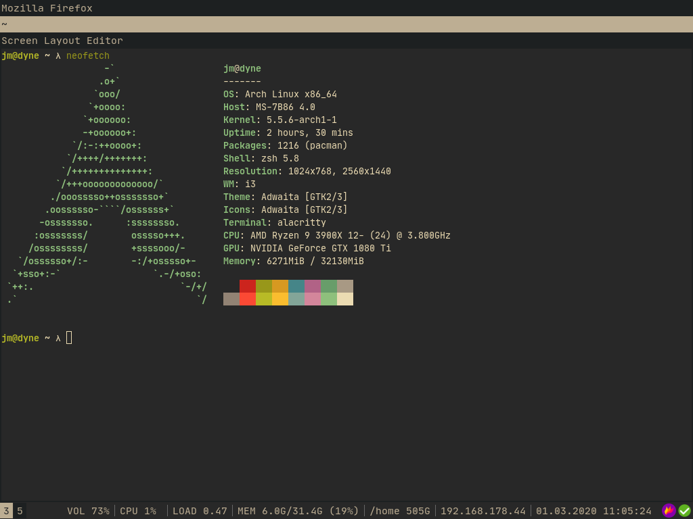

# jmattheis/i3wm-gruvbox-dark



```i3
set $bg #282828
set $red #cc241d
set $green #98971a
set $yellow #d79921
set $blue #458588
set $purple #b16286
set $aqua #689d68
set $gray #a89984
set $darkgray #1d2021
set $lightgray #bdae93

bar {
    position bottom
    status_command i3blocks
    colors {
        # bar background color
        background $bg
        # text color used for blocks that do not have a color specified.
        statusline $lightgray
        # workspaces section            
        #                    border  backgr. text
        focused_workspace    $lightgray $lightgray $bg
        inactive_workspace   $darkgray $darkgray $lightgray
        active_workspace     $darkgray $darkgray $lightgray
        urgent_workspace     $red $red $bg
    }
}

# class                 border|backgr|text|indicator|child_border
client.focused          $lightgray $lightgray $bg $purple $darkgray
client.focused_inactive $darkgray $darkgray $lightgray $purple $darkgray
client.unfocused        $darkgray $darkgray $lightgray $purple $darkgray
client.urgent           $red $red $white $red $red
```
